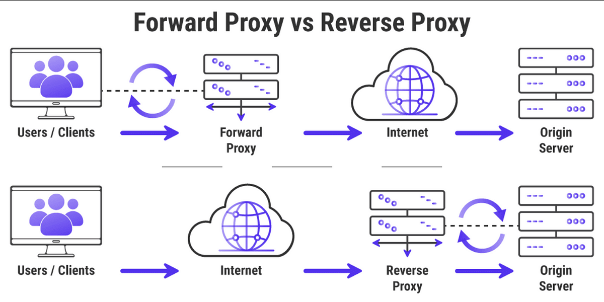

### nginx Reverse Proxy

## 1. Setup nginx proxy defaul
##### Follow steps
1. Run command `apt-get update`
2. `apt-get upgrade`
3. `apt-get install`
4. 
```
   sudo apt-get update -y
#Reading package lists... Done
```
5. 
```
sudo apt-get upgrade -y
Calculating upgrade... Done
```
6. 
```
sudo apt-get install nginx -y
The following Nginx packages will be installed on Ubuntu 22:
```

7. 
```
libnginx-mod-http-geoip2 nginx-common nginx-core nginx-proxy
Setting up nginx 1.18 ubuntu 22... Done
```

8. A status check should indicate that Nginx is active.             
```
sudo systemctl status nginx
● nginx - A high performance web, http and reverse proxy server
   Loaded: loaded (/lib/systemd/system/nginx.service; enabled;)
   Active: active (Nginx server running)
```

### What are ports?
1. virtual point where network connections start and end
2. managed by a computer's operating system
3. Each port is associated with a specific process or service
4. allow computers to easily differentiate between different kinds of traffic: emails go to a different port than webpages


### What is reverse proxy
1. reverse proxy is a server that sits in front of web servers and forwards client (e.g. web browser) requests to those web servers
2. typically implemented to help increase security, performance, and reliability

### What is a proxy server
1. server that sits in front of a group of client machines
2. computers make requests to sites and services on the Internet, the proxy server intercepts those requests and then communicates with web servers on behalf of those clients

### How is reverse proxy different
1. reverse proxy is a server that sits in front of one or more web servers, intercepting requests from clients
2. different from a forward proxy, where the proxy sits in front of the clients. With a reverse proxy, when clients send requests to the origin server of a website
3.  forward proxy sits in front of a client and ensures that no origin server ever communicates directly with that specific client. On the other hand, a reverse proxy sits in front of an origin server and ensures that no client ever communicates directly with that origin server



- nginx default config =  nginx.conf


## 2. Install reverse nginx

1. Install nginx
```sudo apt-get update```
2. 
```sudo apt-get install nginx```
3. Disable the Default Virtual Host
```
sudo unlink /etc/nginx/sites-enabled/default
```
4. Create the Nginx Reverse Proxy - create a file called reverse-proxy.conf within the etc/nginx/sites-available directory to keep reverse proxy information
5. Run command
```
cd etc/nginx/sites-available/
```
6. create the file using the vi editor
```
vi reverse-proxy.conf
``` 

8. Pasta following string:
```
server {
    listen 80;
    location / {
        proxy_pass http://192.x.x.2;
    }
}
```
8. Activate the directives by linking to /sites-enabled/ using the following command:
```
sudo ln -s /etc/nginx/sites-available/reverse-proxy.conf /etc/nginx/sites-enabled/reverse-proxy.conf
```
9. Test Nginx and the Nginx Reverse Proxy:
```
service nginx configtest
```
10. Run command 
```
service nginx restart
```